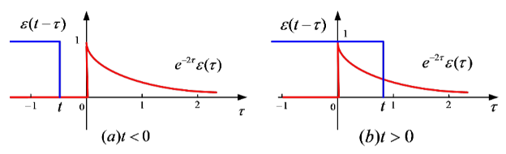
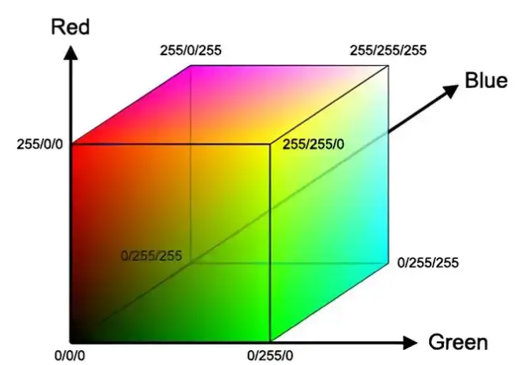
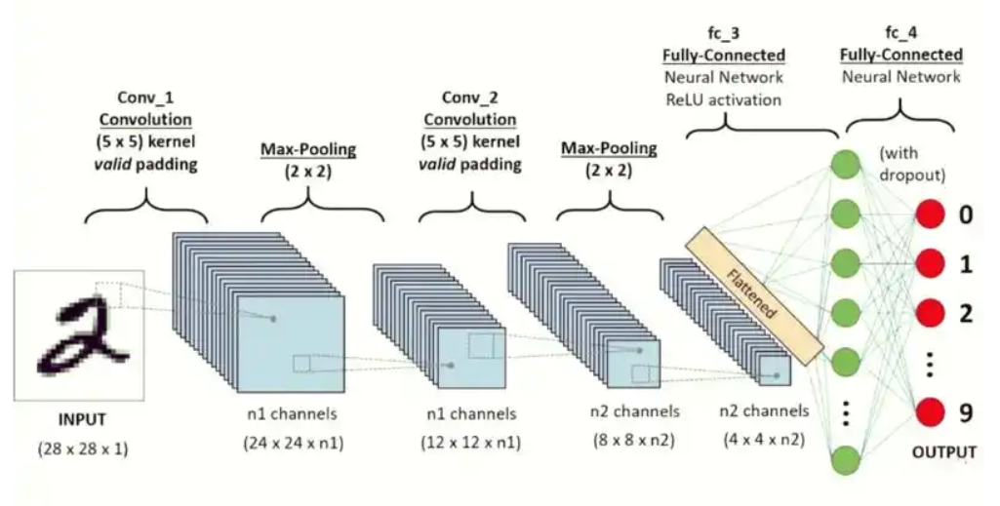
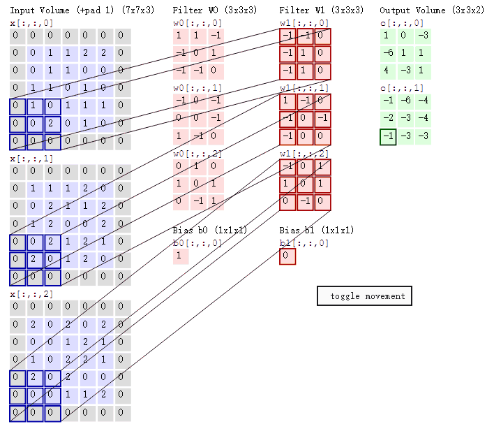
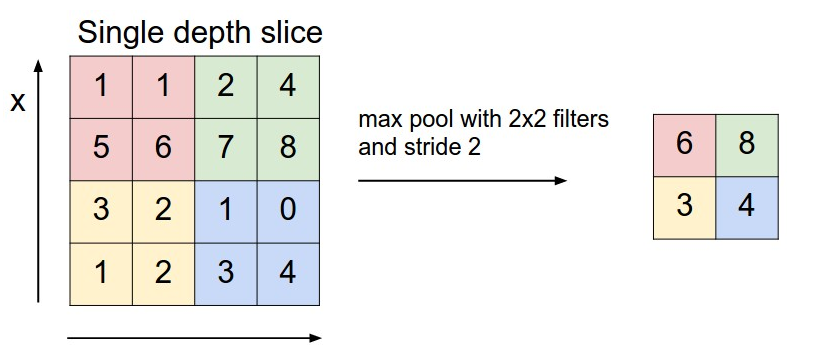
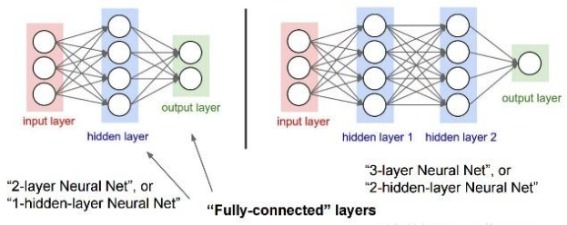
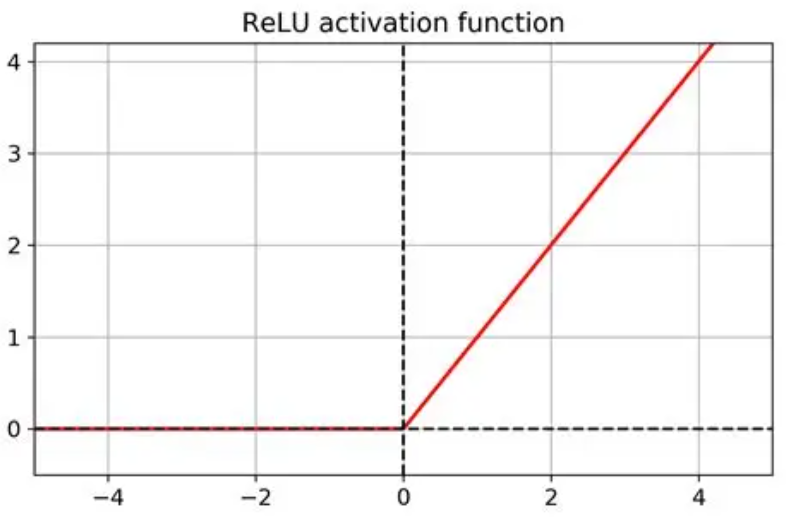
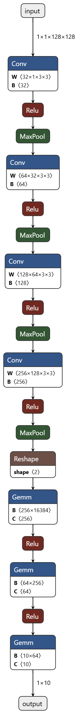

<font face="Times New Roman">

# <center> Convolutional Neural Networks (CNN) -- First Deep Learning Model </center>

<center> Jackson Hao </center>

---


## <center> Table of Contents </center>
- [ Convolutional Neural Networks (CNN) -- First Deep Learning Model ](#-convolutional-neural-networks-cnn----first-deep-learning-model-)
  - [ Table of Contents ](#-table-of-contents-)
  - [ Abstract ](#-abstract-)
  - [ Keywords ](#-keywords-)
  - [1. Introduction](#1-introduction)
    - [1.1 Background](#11-background)
    - [1.2 Structure of Document](#12-structure-of-document)
  - [2. Convolution Operation](#2-convolution-operation)
  - [3. Convolutional Neural Networks(CNN) Architecture](#3-convolutional-neural-networkscnn-architecture)
    - [3.1 Why image data can be processed by convolution operation in CNNs?](#31-why-image-data-can-be-processed-by-convolution-operation-in-cnns)
    - [3.2 Structure of Convolutional Neural Networks](#32-structure-of-convolutional-neural-networks)
    - [3.3 Activiation Functions in CNNs](#33-activiation-functions-in-cnns)
  - [4. Implementing a Simple CNN Model with PyTorch](#4-implementing-a-simple-cnn-model-with-pytorch)
    - [4.1 Setting Up the Environment](#41-setting-up-the-environment)
    - [4.2 Implement CNN with PyTorch](#42-implement-cnn-with-pytorch)
  - [5. Conclusion](#5-conclusion)

---

## <center> Abstract <center>

&ensp;&ensp; This document provides an overview of Convolutional Neural Networks (CNNs), a fundamental deep learning architecture widely used in computer vision tasks. It covers the basic concepts, architecture, and applications of CNNs, highlighting their significance in the field of artificial intelligence.
&ensp;&ensp; Except mathmatical parts, this document also contains how to using programming language Python and PyTorch framework to establish a simple CNN model with using MNIST dataset to build a handwriting digits recongnition system. If you are interested in deep learning and computer vision, this document will be a good starting point for you to understand CNNs and their applications.
&ensp;&ensp; This document displays my learning process and understanding of CNNs, thus it may have some inaccuracies or incomplete explanations. If you find any mistakes or have suggestions for improvement, please feel free to contact with me. All feedbacks are greatly appreciated!

## <center> Keywords <center>
&ensp;&ensp; Convolutional Neural Networks (CNN), Deep Learning, Computer Vision, Image Recognition, PyTorch, MNIST Dataset, Handwriting Recognition

---

## 1. Introduction
### 1.1 Background
&ensp;&ensp; Convolutional Neural Networks (CNNs) are a class of deep learning models specifically designed for processing structured grid data, such as images. They have revolutionized the field of computer vision by enabling machines to automatically learn and extract features from visual data, leading to significant advancements in image recognition, object detection, and other related tasks.
&ensp;&ensp; In this document, I learnt from what is convolution operation, how CNNs are structured, and how they can be implemented using popular deep learning frameworks like PyTorch. By the end of this document, I hope to have a solid understanding of CNNs and their applications in real-world scenarios.

### 1.2 Structure of Document
&ensp;&ensp; This document is organized into several sections. Following this introduction, Section 2 introduces what is the convolution operation from the mathematical perspective. Section 3 discusses the architecture of CNNs, including convolutional layers, pooling layers, and fully connected layers. Section 4 introduce how to implement a simple CNN model using PyTorch and the MNIST dataset for handwriting digit recognition.

&ensp;&ensp; Finally, Section 5 concludes the document with a summary of key points and potential future directions for further study in the field of CNNs and deep learning.

## 2. Convolution Operation

&ensp;&ensp; Convolution is a mathematical operation that combines two functions to produce a third function. This operation you can understand as a way to extract features from input data by applying a filter or kernel.

&ensp;&ensp; In class Signal and Systems, convolution is defined as:

$$ y(t) = f(t) * g(t) = \int_{-\infty}^{\infty} f(\tau) g(t - \tau) d\tau $$

- Where:
  - $ y(t) $ is the output signal
  - $ f(t) $ is the input signal
  - $ g(t) $ is the convolution kernel or filter
  - $ * $ denotes the convolution operation

&ensp;&ensp; As what you can see, this farmula is very abstruct. But it describes a process that a function $ g(t) $ is flipped and shifted across the input function $ f(t) $, and at each position, the overlapping areas are multiplied and summed to produce the output function $ y(t) $.

<center>



**A visualization of convolution operation.**

</center>

&ensp;&ensp; Convolution operation reflect how history data infuences the current output, or extract features from input data. In the context of CNNs, convolution is used to process images by applying filters that can detect edges, textures, and other patterns.

## 3. Convolutional Neural Networks(CNN) Architecture
### 3.1 Why image data can be processed by convolution operation in CNNs?
&ensp;&ensp; Different from convolution operation being used to describe the relationship between input and output in LTI systems in *Signal and Systems*, in CNNs, convolution operation is used as a fundamental building block to extract features from input images. The convolution operation in CNNs involves sliding a small filter or kernel over the input image and performing element-wise multiplication and summation to produce a feature map.
&ensp;&ensp; As we all know, image data is stored in computer as a grid of pixels, where each pixel has a specific intensity value. In RGB color space, each pixel has three color channels: Red, Green, and Blue.



**<center> RGB Color Space </center>**

&ensp;&ensp; Thus, a RGB image can be represented as a 3D tensor. For instance, in Pytorch framework, an image with channels, height, and width can be represented as a tensor of shape (C, H, W). Here, C represents the number of color channels (3 for RGB), H represents the height of the image in pixels, and W represents the width of the image in pixels. If we only see one face(channel) of the image, it will be a 2D matrix which a element in the matrix represents the intensity value of a pixel in current channel.


**<center> RGB Image Tensor Representation </center>**

&ensp;&ensp; In CNNs, a filter or kernel is a small matrix of weights that is used to scan over the input image. The filter is typically much smaller than the input image, for example, a 3x3 or 5x5 matrix. As the filter slides over the image, it performs element-wise multiplication with the corresponding pixel values in the image and sums them up to produce a single value in the output feature map.

&ensp;&ensp; Next, we will use only gray-scale channle of an image to illustrate how convolution operation works in CNNs and how to implement it using Python code.

### 3.2 Structure of Convolutional Neural Networks
&ensp;&ensp; A typical CNN architecture consists of several types of layers, including input layers, convolutional layers, pooling layers, and fully connected layers. Each layer plays a specific role in the feature extraction and classification process.



**<center> CNN Architecture Overview </center>**

&ensp;&ensp; For convolutional layers, take a example of a 5x5 gray-scale image and a 3x3 filter(kernel). The convolution operation can be performed as follows:



**<center> Convolution Operation Example </center>**

&ensp;&ensp; In this example, the 3x3 filter is slid over the 5x5 image, and at each position, element-wise multiplication is performed followed by summation to produce a single value in the output feature map. The resulting feature map will have a size of 3x3, as the filter can only fit into the image in certain positions.
&ensp;&ensp; You can clearly see that after convolution operation, the output feature map has a smaller spatial dimension compared to the input image. This processing helps to extract important features while reducing the computational complexity of the model.
&ensp;&ensp; After convolutional layers, pooling layers are often used to further reduce the spatial dimensions of the feature maps. Pooling layers perform down-sampling operations, such as max pooling or average pooling, to retain the most important information while discarding less relevant details.



**<center> Pooling Operation Example </center>**

&ensp;&ensp; Finally, fully connected layers are used to perform classification based on the extracted features. These layers connect every neuron in one layer to every neuron in the next layer, allowing the model to learn complex relationships between the features and the target classes.



**<center> Fully Connected Layer Example </center>**

&ensp;&ensp; In summary, CNNs leverage convolutional layers to extract hierarchical features from images, pooling layers to reduce spatial dimensions, and fully connected layers to perform classification. This architecture has proven to be highly effective in various computer vision tasks, enabling machines to achieve human-level performance in image recognition and related applications.

### 3.3 Activiation Functions in CNNs

&ensp;&ensp; But we can easily find a problem here. If we only use convolutional layers and fully connected layers in CNNs, the model will be a linear model. No matter how many layers we stack, the overall function represented by the network will still be linear. This is because the composition of linear functions is still a linear function.
&ensp;&ensp; To address this issue, activation functions are introduced after convolutional layers and fully connected layers in CNNs. Activation functions introduce non-linearity into the model, allowing it to learn complex patterns and relationships in the data.
&ensp;&ensp; Activiation functions allows model have the non-linear mapping capability. After convolution operation, we apply an activation function to the output feature map, so that the model can learn non-linear features from the input data.
&ensp;&ensp; Commonly used activation functions in CNNs include ReLU (Rectified Linear Unit), Sigmoid, and Tanh.

$$ \text{ReLU}(x) = \max(0, x) \quad \text{Sigmoid}(x) = \frac{1}{1 + e^{-x}} \quad \text{Tanh}(x) = \frac{e^{x} - e^{-x}}{e^{x} + e^{-x}} $$

&ensp;&ensp; Among these, ReLU is the most widely used activation function in CNNs due to its simplicity and effectiveness. ReLU introduces non-linearity by setting all negative values to zero, while keeping positive values unchanged. However, ReLU can lead to the "neuron death" problem, where neurons can become inactive and stop learning if they consistently receive negative inputs.



**<center> ReLU Activation Function </center>**

&ensp;&ensp; In summary, activation functions play a crucial role in CNNs by introducing non-linearity into the model. They enable the network to learn complex patterns and relationships in the data, enhancing its ability to perform tasks such as image recognition and classification.

## 4. Implementing a Simple CNN Model with PyTorch
### 4.1 Setting Up the Environment

&ensp;&ensp; Before we start implementing a simple CNN model using PyTorch, we need to set up the environment by installing the necessary libraries. Make sure you have Python installed on your system, and then you can install PyTorch and other required libraries using pip.
> 
> ```bash
> pip install torch torchvision matplotlib
> ```

&ensp;&ensp; If your computer has a compatible NVIDIA GPU, you can also install the CUDA version of PyTorch to leverage GPU acceleration for faster training.

### 4.2 Implement CNN with PyTorch

&ensp;&ensp; Now that we have set up the environment, let's implement a simple CNN model using PyTorch. We will use the MNIST dataset, which consists of handwritten digit images, to build a digit recognition system.

&ensp;&ensp; Here, I paste the complete code for implementing a simple CNN model with PyTorch:

```python
# model.pys
import torch
import torch.nn as nn

class CNN(nn.Module):
    def __init__(self, input_size=(128, 128), num_classes=10):
        super(CNN, self).__init__()
        self.conv1 = nn.Conv2d(1, 32, 3, padding=1)
        self.bn1 = nn.BatchNorm2d(32)
        self.conv2 = nn.Conv2d(32, 64, 3, padding=1)
        self.bn2 = nn.BatchNorm2d(64)
        self.conv3 = nn.Conv2d(64, 128, 3, padding=1)
        self.bn3 = nn.BatchNorm2d(128)
        self.conv4 = nn.Conv2d(128, 256, 3, padding=1)
        self.bn4 = nn.BatchNorm2d(256)
        self.pool = nn.MaxPool2d(2, 2)
        self.dropout = nn.Dropout(0.5)

        # Auto calculate the size of the feature map after convolutions and poolings
        h, w = input_size
        for _ in range(4):
            h, w = h // 2, w // 2
        self.fc1 = nn.Linear(256 * h * w, 256)
        self.fc2 = nn.Linear(256, 64)
        self.fc3 = nn.Linear(64, num_classes)

    def forward(self, x):
        x = self.pool(torch.relu(self.bn1(self.conv1(x))))
        x = self.pool(torch.relu(self.bn2(self.conv2(x))))
        x = self.pool(torch.relu(self.bn3(self.conv3(x))))
        x = self.pool(torch.relu(self.bn4(self.conv4(x))))
        x = x.view(x.size(0), -1)
        x = self.dropout(torch.relu(self.fc1(x)))
        x = torch.relu(self.fc2(x))
        x = self.fc3(x)
        return x
```

&ensp;&ensp; In my code, I define 4 convolutional layers, each followed by a batch normalization layer and a ReLU activation function. After every two convolutional layers, I apply a max pooling layer to reduce the spatial dimensions of the feature maps. Finally, I flatten the feature maps and pass them through three fully connected layers to perform classification.

&ensp;&ensp; After training the model, I transform it from PyTorch format to ONNX format for better deployment and compatibility with other frameworks.

 

**<center> ONNX Model Format </center>**

&ensp;&ensp; In summary, implementing a simple CNN model using PyTorch involves defining the architecture with convolutional, pooling, and fully connected layers, as well as applying activation functions to introduce non-linearity. By training this model on the MNIST dataset, we can build an effective digit recognition system.

## 5. Conclusion

&ensp;&ensp; In this document, we explored the fundamentals of Convolutional Neural Networks (CNNs), including the convolution operation, CNN architecture, and the role of activation functions. We also implemented a simple CNN model using PyTorch to recognize handwritten digits from the MNIST dataset.
&ensp;&ensp; CNNs have proven to be powerful tools for image recognition and computer vision tasks, enabling machines to learn complex patterns and features from visual data. By leveraging convolutional layers, pooling layers, and fully connected layers, CNNs can effectively extract hierarchical features and perform accurate classification.
&ensp;&ensp; After completing this document, I have gained a solid understanding of CNNs and their applications in deep learning. Now, I'm on the way to learn ResNet-18 model so the next document is on ResNet-18. Stay tuned!
&ensp;&ensp; If you like this document, please give me a star on my Github repository! Your support means a lot to me and encourages me to continue sharing my knowledge and learning experiences. Thank you for reading!

</font>